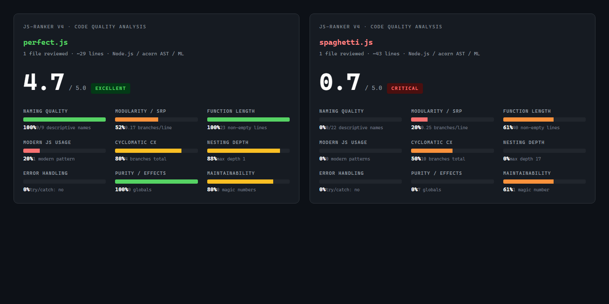

# 📈 Js-Ranker

> **Évalue la qualité de tes fonctions JavaScript par Machine Learning.**
> 10 features extraites par analyse AST (`acorn`) + modèle TensorFlow.js entraîné en ~15 s → un score 0-100 par fonction, utilisable en CLI, API REST, ou Quality Gate CI/CD.

[](https://nodejs.org/)
[](https://www.tensorflow.org/js)
[](https://github.com/acornjs/acorn)
[](https://expressjs.com/)
[](https://github.com/Abdoulrazack1/Js-Ranker)
[](LICENSE)

## 📊 Exemple — perfect.js vs spaghetti.js (sortie réelle CLI)

[](screenshots/comparison.png)

> Comparaison réelle générée par `node index.js analyze examples/{perfect,spaghetti}.js`.
> 9 critères évalués (Naming, Modularity, Function length, Modern JS, Cyclomatic, Nesting, Error handling, Purity, Maintainability) avec score 0-5 et verdict.

---

## 💡 Pourquoi Js-Ranker

| Pour qui | Cas d'usage |
|---|---|
| **Reviewers de code** | Highlight automatiquement les fonctions à risque dans une PR |
| **Lead tech** | Quality Gate CI/CD — refuse les PRs qui dégradent le score moyen du repo |
| **Étudiants** | Comprends *quelles métriques* font la qualité d'une fonction (les 10 features sont explicites) |
| **Chercheurs en analyse statique** | Dataset versionné + modèle reproductible pour benchmark |
| **Toolmakers** | API REST simple — intègre dans ton linter, IDE plugin, ou bot Slack |

---

## 🧠 Les 10 features AST

Chaque fonction JS est parsée en AST (via `acorn`), puis 10 métriques sont extraites :

| # | Feature | Élevé = | Signification |
|---|---|---|---|
| F1 | **Complexité Cyclomatique** | MAUVAIS | Nombre de chemins logiques (if/else/loops) |
| F2 | **Imbrication Maximale** | MAUVAIS | Profondeur max des blocs imbriqués |
| F3 | **Ratio de Nommage** | BON | Proportion d'identifiants descriptifs vs single-letter |
| F4 | **Linéarité** | BON | Inverse de la complexité cyclo — "ça se lit du haut vers le bas" |
| F5 | **Modularité (nb args)** | BON | Trop d'args = fonction qui fait trop |
| F6 | **Comment Ratio** | BON | Commentaires / LOC |
| F7 | **Return Complexity** | MAUVAIS | Multiple returns conditionnels complexes |
| F8 | **Async/Await** | BON | Usage moderne plutôt que callbacks |
| F9 | **Magic Numbers** | MAUVAIS | Littéraux numériques non-nommés |
| F10 | **Chain Length** | MAUVAIS | `a.b.c.d.e.f()` — trop de chaînage |

Le modèle TF.js apprend les coefficients depuis un dataset de fonctions réelles annotées.

---

## 📦 Quick Start

```bash
git clone https://github.com/Abdoulrazack1/Js-Ranker.git
cd Js-Ranker
npm install

# Si le dataset existant a moins de 10 features :
node migrate-dataset.js

# Entraîne le modèle (~15s sur CPU)
npm run train

# Vérifie
node index.js status
```

---

## 🛠️ Utilisation

### CLI

```bash
# Analyse rapide d'un fichier
node index.js <fichier.js>

# Analyse détaillée (avec breakdown features)
node index.js analyze <fichier.js>

# Depuis une URL GitHub raw
node index.js url https://raw.githubusercontent.com/user/repo/main/util.js

# Snippet inline
node index.js snippet "const f = x => x"

# Entraînement progressif sur gros dataset
node index.js stream-train dataset-large.json
```

### API REST

```bash
npm run serve   # démarre sur :3000

curl -X POST http://localhost:3000/analyze \
  -H "Content-Type: application/json" \
  -d '{"code": "const add = (a, b) => a + b;"}'
```

**Réponse** :
```json
{
  "score": 87,
  "features": {
    "cyclomatic": 1,
    "nesting": 1,
    "naming_ratio": 1.0,
    "linearity": 0.95,
    "modularity": 0.8,
    "comment_ratio": 0,
    "return_complexity": 1,
    "async_usage": 0,
    "magic_numbers": 0,
    "chain_length": 0
  },
  "verdict": "Clean",
  "suggestions": []
}
```

### Quality Gate CI/CD

Ajoute dans `.github/workflows/quality.yml` :

```yaml
- name: Js-Ranker Quality Gate
  run: |
    npx js-ranker analyze src/ --min-score 60 --fail-on-low
```

→ La CI **échoue** si une fonction passe sous 60/100.

---

## 📊 Générer un gros dataset depuis GitHub

```bash
node generate-dataset.js --max 2000 --token ghp_xxx
node index.js stream-train dataset-large.json
```

Le script scrape les top repos JS, extrait les fonctions, annote automatiquement (via les 10 features), et produit `dataset-large.json`. Tu peux ensuite stream-train un modèle plus performant.

---

## 🏗️ Architecture

```
js-ranker/
├── index.js                # CLI entry point (commander)
├── src/
│   ├── ast/                # Parsing acorn + extraction features
│   │   ├── extract-features.js
│   │   └── walker.js
│   ├── model/              # TF.js model definition + training
│   │   ├── train.js
│   │   ├── predict.js
│   │   └── serialize.js
│   └── server.js           # Express API
├── models/
│   └── js-ranker/          # Poids du modèle entraîné (TF.js JSON + bin)
├── data/
│   ├── dataset.json        # Dataset annoté
│   └── dataset-large.json  # Dataset étendu (généré)
├── analysis/               # Scripts d'analyse de résultats
├── examples/
│   ├── clean.js            # Score élevé attendu
│   └── messy.js            # Score bas attendu
├── migrate-dataset.js      # Migration v1→v2 (10 features)
├── generate-dataset.js     # Scraping GitHub
└── DOCUMENTATION.md        # Doc complète
```

---

## 🆚 Comparaison

| Outil | Approche | Configurable | Score continu | Self-host |
|---|---|---|---|---|
| **Js-Ranker** | ML (10 features AST) | Re-train sur ton style | ✅ 0-100 | ✅ |
| ESLint | Règles statiques | Très (config) | ❌ Binaire | ✅ |
| SonarJS | Règles + heuristiques | Modérément | ✅ A-E | ⚠️ (SaaS ou self-host lourd) |
| Codacy | Règles + ML cloud | Modérément | ✅ A-F | ❌ SaaS |
| CodeClimate | Règles | Modérément | ✅ A-F | ❌ SaaS |

**Force de Js-Ranker** : tu peux **re-entraîner** le modèle sur ton propre codebase pour qu'il colle à ton style maison — pas possible avec ESLint/Sonar.

---

## ⚠️ Limitations connues

- **JavaScript uniquement** — pas de TypeScript types pris en compte (juste le code transpilé)
- **Pas de cross-file analysis** — chaque fonction est jugée isolément
- **Dataset relativement petit** (~quelques centaines de fonctions seed) — gain net avec `generate-dataset.js`
- **Score = signal**, pas vérité absolue — toujours faire reviewer humain

---

## 🤝 Contribuer

Voir [CONTRIBUTING.md](CONTRIBUTING.md). Toutes contributions bienvenues — nouvelles features AST, port TypeScript, plugin VS Code, intégration GitHub Action, dataset enrichi.

## 📚 Documentation complète

Voir [`DOCUMENTATION.md`](DOCUMENTATION.md) pour l'architecture détaillée, le format du dataset, et les choix d'hyperparamètres.

## 📜 Licence

MIT — fais-en ce que tu veux.

## 🔗 Auteur

[@Abdoulrazack1](https://github.com/Abdoulrazack1)
